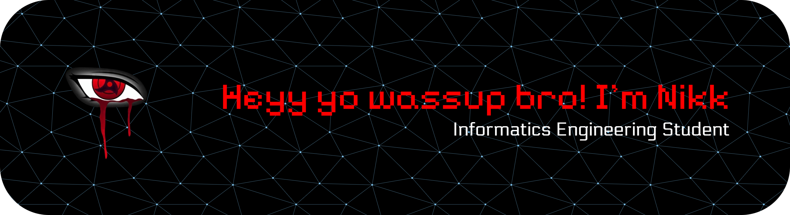

- 🌱 I am currently learning [**React**](https://react.dev/) and [**Flutter**](https://flutter.dev/) frameworks.

- 🏫 I am currently studying at **STMIK Widya Utama**.
##
### Studying 

       
  
          

##
### My Github Stats

   
  

##

### Play With Me!

###

<picture>
  <source media="(prefers-color-scheme: dark)" srcset="https://raw.githubusercontent.com/NikkkDevvv/NikkkDevvv/output/pacman-contribution-graph-dark.svg">
  <source media="(prefers-color-scheme: light)" srcset="https://raw.githubusercontent.com/NikkkDevvv/NikkkDevvv/output/pacman-contribution-graph.svg">
  
</picture>

###

###

  

###
